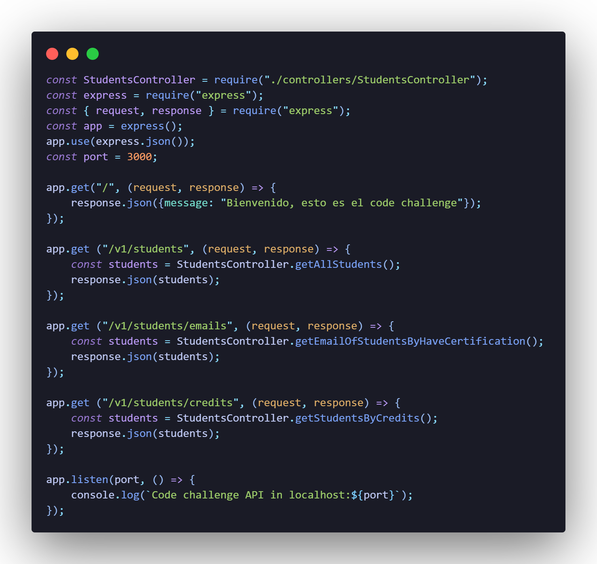

# Code Challenge

Para este proyecto se tuvo que realizar un API en base a los seguientes requerimientos:

1. Habilitar un endpoint para consultar todos los estudiantes con todos sus campos.
2. Habilitar un endpoint para consultar los emails de todos los estudiantes que tenga certificación `haveCertification`.
3. Habilitar un endpoint para consultar todos los estudiantes que tengan `credits` mayor a 500.

Para lograr todas estás consultas Visual Partner-Ship, quién es el encargado de los cursos de Visual Thinking brindó la db en formato JSON de los estudiantes.

En el siguiente gráfico se muestra la estructura del proyecto y de todo lo que conlleva.


Créditos de la imagen: @carlogilmar

Las dependencias que se utilizaron fueron las siguientes:
* Jest: Nos permitirá realizar las pruebas de unidad. Jest se enfoca en el código de JavaScript.
* Express: Nos permitirá realizar la API.

Como se menciona en el gráfico anterior unos de los objetivos es separar responsabilidades, es decir, por un lado se tiene la lógica que es la clase `Reader` que nos permite utilizar la db de los estudiantes y la clase `StudentService` que es donde se encuentran los métodos necesarios para poder realizar las consultas. Y por otro lado, se necesita una clase que permita extender un puente entre la funcionalidad y el server, para que el server que será el API solo se comuniqué a partir de ahí, la clase que será el puente entre la lógica y el server es `StudentsController`. Por tal motivo, para la creación de este proyecto se dividio en dos partes.


## Primera parte - Creación de la lógica

### Clase Reader

`Archivo Reader.js`

Como se menciono anteriormente se creó una clase llamada Reader y dentro de la clase se implemento el método readJsonFile que basicamente nos permitirá leer los archivos Json, en este caso sería el archivo `visualpartners.json` que es la db de los estudiantes.


`Archivo Reader.test.js`

Antes de continuar se realizo su respectiva prueba de unidad a la clase Reader, para esto se tuvo que instalar Jest.

Para este caso solo se hicieron 2 test. El primero consiste en obtener el tamaño de la lista o mejor dicho, la cantidad de estudiantes de Visual Partner-Ship y el segundo consiste en coincidir el nombre del estudiante con la posición solicitada. En ambos casos los 2 test fueron correctos.


### Clase StudentService

`Archivo StudentService.js`

Se creó una clase llamada StudentService, dentro de la clase se crearon 3 métodos, las cuáles reciben como parámetro students que basicamente es el archivo JSON `visualpartners.json`. En la siguiente imagen se muestran los métodos creados: 


* getAllStudents: Permite consultar todos los estudiantes con todos sus campos. 
* getEmailOfStudentsByHaveCertification: Permite consultar los emails de todos los estudiantes que tengan certificación.
* getStudentsByCredits: Permite consultar todos los estudiantes que tengan credits mayor a 500.

**QUIZÁS PONER HASTA EL FINAL**
Nota: Para este paso en los últimos 2 métodos aparte de filtrar a los estudiantes se podríar usar el método map para obtener los datos especificos, es decir, si en el segundo método se solicitan los emails con el map solo tendriamos los emails pero no se mostrarían los otros datos como el nombre lo cuál sería algo confuso si se necesitará saber a quién le pertenece dicho datos. Así mismo pasa con el tercer método, solo se tendrían los créditos pero no se sabría a quienes pertenecen, es por eso que optó por no poner el map en los últimos 2 métodos, pero si quisieramos usar los maps quedaría de la siguiente manera:


Y en el endpoint nos devolvería el siguiente resultado en el caso de emails:


`Archivo StudentService.test.js`

Para la clase StudentService también se realizarón pruebas, en este caso se realizaron 3 test en base a los 3 métodos que se crearon. Para esto también se hizo uso de la clase Reader para poder utilizar el archivo JSON `visualpartners.jso`. A continuación se explican brevemente los test:
* Test 1: Consultar la cantidad de todos los estudiantes. Que tiene como resultado esperado 51 ya que es la cantidad de estudiantes que tiene la db.
* Test 2: Consultar la cantidad de emails de todos los estudiantes que tengan certificación haveCertification. Que tiene como resultado esperado la cantidad de 29 estudiantes con la certificación.
* Test 3: Consultar la cantidad de estudiantes que tengan credits mayor a 500. Que tiene como resultado esperado la cantidad de 27 estudiantes que tienen de créditos mayor a 500.


### GitHub Actions

También se hizo uso de GitHub Actions para las pruebas automatizadas, esto con el fin de cada que se haga un push en la parte de Actions del repositorio nos muestre si hay un error con las pruebas o todo esta bien. Para esto se creó un archivo en la siguiente ruta:
`.github/workflows/test.yml`

Y en el mismo archivo se útilizo la siguiente configuración:
```
name: Run Tests in my project every push on GitHub

on: push
jobs:
  test:
    runs-on: ubuntu-latest
    steps:
      - uses: actions/checkout@v2
      - name: Setup Node.js
        uses: actions/setup-node@v1
        with:
          node-version: "12"

      # Speed up subsequent runs with caching
      - name: Cache node modules
        uses: actions/cache@v2
        env:
          cache-name: cache-node-modules
        with:
          # npm cache files are stored in `~/.npm` on Linux/macOS
          path: ~/.npm
          key: ${{ runner.os }}-build-${{ env.cache-name }}-${{ hashFiles('**/package-lock.json') }}
          restore-keys: |
            ${{ runner.os }}-build-${{ env.cache-name }}-
            ${{ runner.os }}-build-
            ${{ runner.os }}-

      # Install required deps for action
      - name: Install Dependencies
        run: npm install

      # Finally, run our tests
      - name: Run the tests
        run: npm test
```

## Segunda parte - Crear un API para exponer las funcionalidades

Para utilizar las funcionalidades creadas en la primera parte se tienen que exponer haciendo uso de un API.

|          Endpoint   |           Response      |
|---------------------|-------------------------|
| `localhost:3000/v1/students` | Se deberá obtener la lista de estudiantes completa.|
| `localhost:3000/v1/students/emails` | Se deberá obtener los emails de todos los estudiantes que tengan certificación haveCertification.|
| `localhost:3000/v1/students/credits`  | Se deberá obtener todos los estudiantes que tengan credits mayor a 500.|

### Clase StudentsController

`Archivo StudentsController.js`

Se necesito importar la clase StudentService para poder útilizar los métodos creados anteriormente, lo que es la lógica así como también a la clase Reader para que nos permita leer el archivo JSON de `visualpartners.json`.
Dentro de la clase StudentsController se crearon los 3 métodos necesarios, que son:
* StudentsController: Con el que obtendremos la lista de todos los estudiantes. Se crea una constante, que recibe el nombre de students y se le asigna la clase Reader que hace uso del método readJsonFile al cuál se le envía como parámetro el archivo Json y después se hace un return utilizando la clase StudentService que hace uso del método getAllStudents al cuál se le envía como parámetro la constante creada anteriormente. Y así sucede con los otros dos métodos.
* getEmailOfStudentsByHaveCertification: Con el se obtendrá la lista de los estudiantes que tengan certificación.
* getStudentsByCredits: Con este método se obtendrá la lista de los estudiantes que tengan créditos mayor a 500.


`Archivo StudentsController.test.js`

Se realizaron 3 test a la clase StudentsController ya que son 3 métodos que se utilizan.

* Test 1: Obtener la cantidad de todos los estudiantes. Y como resultado esperado se pone 51, ya que hay un total de 51 estudiantes.
* Test 2: Obtener la cantidad de emails de los estudiantes que tengan haceCertification. Y como resultado esperado se pone 29, ya que hay un total de 29 estudiantes que tienen la certificación.
* Test 3: Obtener la cantidad de estudiantes que tengan credits mayor a 500. Y como resultado esperado se pone 27, ya que hay 27 estudiantes que tienen créditos mayor a 500.


### Creando server con API
Para este paso se instaló express y se creó un server básico. Así también se creó un script en `lib/server.js`.

Dentro del archivo `server.js` se importo el controller y se crearon los endpoints. Con el primer endpoint se obtiene un mensaje de bienvenida al ingresar al server. Con el segundo endpoint se obtienen la lista de todos los estudiantes. Con el tercer endpoint se obtienen los emails y con el último endpoint la lista de estudiantes que tienen creditos mayor a 500.



`Endpoint para consultar todos los estudiantes con todos sus campos.`


`Endpoint para consultar los emails de todos los estudiantes que tengan certificación haveCertification.`


`Endpoint para consultar todos los estudiantes que tengan credits mayor a 500.`


Por último, en el siguiente diagrama se representa el flujo de la funcionalidad:


El único punto de conexión que debe haber entre nuestra funcionalidad y el server será el StudentsController. Así vamos a mantener una organización y separación de responsabilidades adecuado.